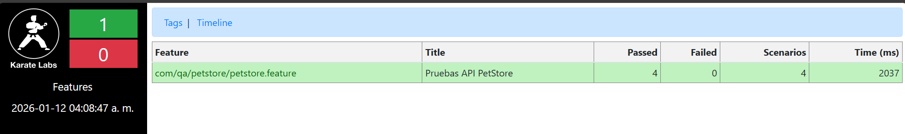
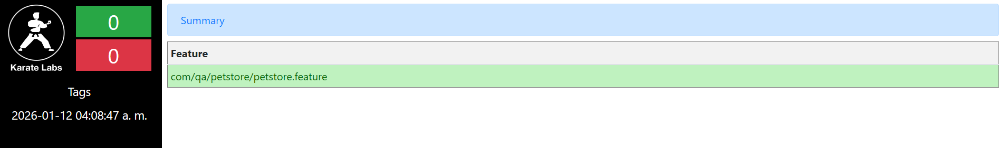
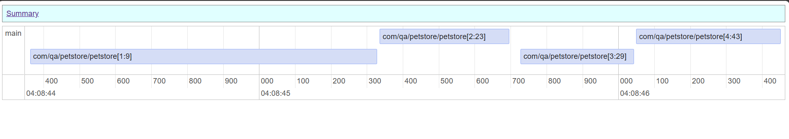

# Pruebas de Performance - Login API

## 1. Prerequisitos

- Sistema Operativo: Windows 11
- Editor: Visual Studio Code
- Java: 21
- Serenity: 4
- chromedriver: version de chrome actual
- Git instalado y configurado: git version 2.47.0.windows.2
- Cuenta GitHub

## 2. Comandos de instalación

Clonar el repositorio: 
```bash
git clone https://github.com/M4t3B4rriga/ExamenPracticoNTT_Data_Mateo_Barriga.git
```
Ingresar a la carpeta: 
```bash
cd APIS
```

Ingresar a la carpeta: 
```bash
cd karate-petstore
```

Ejecutar: 
```bash
mvn clean compile
```
Para ejecutar las pruebas:
```bash
mvn test
```

Reportes:
Abrir con liveServer o en Chrome. 

En la carpta target\karate-reports\karate-summary.html 


En la carpta target\karate-reports\karate-tags.html 


En la carpta target\karate-reports\karate-timeline.html 
