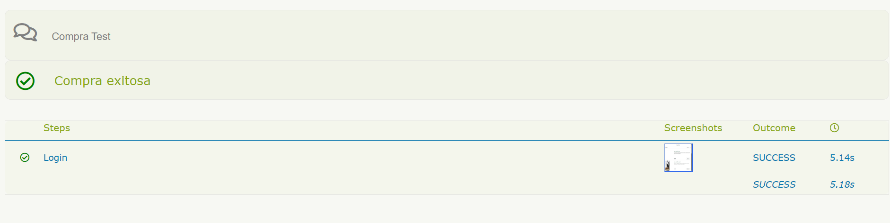

# Pruebas de Performance - Login API

## 1. Prerequisitos

- Sistema Operativo: Windows 11
- Editor: Visual Studio Code
- Java: 11
- Serenity: 4
- chromedriver: version de chrome actual
- Git instalado y configurado: git version 2.47.0.windows.2
- Cuenta GitHub

## 2. Comandos de instalación

Clonar el repositorio: 
```bash
git clone https://github.com/M4t3B4rriga/ExamenPracticoNTT_Data_Mateo_Barriga.git
```
Ingresar a la carpeta: 
```bash
cd serenity-saucedemo
```
Instalar chromedriver:
Ingresamos a la pagina y descargamos el chromedriver  
```bash
ingresar al link: https://chromedriver.chromium.org/downloads
```
1. Dentro del disco local C creamos una carpeta llamada "drivers" 
2. Descomprimimos el archivo previamente descargado
3. Copiamos a ruta de la carpeta
4. Vamos a propiedades del sistema y abrimos el opciones avanzadas/variables de entorno y abrimos el path
5. Agregamos la ruta de la carpeta y aceptamos todo
6. Cerramos los CMD que tengamos abiertos y abrimos uno nuevo
7. Verificamos que este correctamente instalado. 
```bash
chromedriver --version
```
Ejecución de prueba:
```bash
mvn clean test
```
Para ver el reporte: 
El reporte se genera en target/site/serenity/c713634b2275328123a5b129b2241a7e6d7fff9a07ebe6def7cd1fbb132a9125
```bash
Open whit live server
```

Resultados: 



